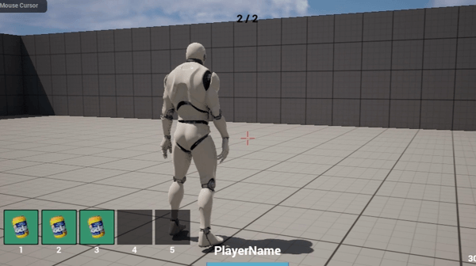

이 프로젝트는 FPS 게임에서 사용되는 무기시스템, 간단한 인벤토리 시스템, 멀티플레이시 실시간 네트워크 동기화를 사용해 구현한 예제입니다. 그레네이드의 궤적 계산, 충돌 처리, 미사일의 타격감과 물리적 상호작용을 포함하며, 서버와 클라이언트 간의 동기화 문제를 해결하기 위한 네트워크 코드도 포함되어 있습니다.

## 주요 기능

### 1. Rifle, Shotgun 무기 구현
- 플레이어가 **소총 및 샷건**을 사용할 때의 발사 메커니즘과 타격 판정을 구현.
- 서버와 클라이언트 간의 발사 결과를 동기화하여 모든 플레이어에게 동일한 전투 경험을 제공.

  
*소총 발사 메커니즘*

  
*샷건 발사 메커니즘*

---

### 2. LandMine 지뢰 구현
- 플레이어가 지뢰를 설치할 수 있는 기능을 구현.
- 적이 지뢰에 접근하거나 밟을 때 폭발 및 데미지를 처리하는 시스템.

---

### 3. GrenadeLauncher 궤적 계산 및 범위 데미지
- 그레네이드 런처에서 발사된 투사체의 궤적을 물리 엔진을 통해 계산.
- 폭발 범위 내 적에게 데미지를 입히는 시스템을 구현, 서버-클라이언트 간 동기화를 통해 동일한 경험을 제공.

  
*그레네이드 런처 발사 및 폭발 범위 데미지*

---

### 4. Missile 충돌 처리 및 유도기능 구현
- **미사일이 적 또는 물체에 충돌할 때의 충돌 처리**와 폭발 이펙트를 구현.
- **유도 기능**을 통해 미사일이 목표물을 추적하는 시스템 구현.
- 미사일 발사 전 **Target을 지정**하여 Actor가 움직이더라도 추적 가능.

  
*미사일 충돌 및 유도 기능*

---

### 5. 실시간 네트워크 동기화
- 서버와 클라이언트 간에 **무기 및 투사체 데이터를 동기화**하여, 모든 플레이어에게 일관되고 매끄러운 멀티플레이 환경을 제공.

---

### 6. 인벤토리 시스템
- 플레이어가 아이템을 추가 및 제거할 수 있는 **인벤토리 시스템**을 구현.
- 게임 내에서 아이템을 장착하거나 교체할 수 있도록 설계.

  
*인벤토리에 아이템 추가*

  
*인벤토리에서 아이템 제거*

---

### 7. 멀티플레이 서버 접속 및 게임 관리
- **서버 접속을 통해 여러 플레이어를 수용**할 수 있으며, 지정된 인원수가 모두 차면 게임이 자동으로 시작됩니다.
- **게임 종료 조건**: 게임이 진행 중일 때, 남은 플레이어가 1명일 경우 게임이 자동으로 종료됩니다.
- 이러한 멀티플레이 환경은 서버에서의 플레이어 상태를 추적하며, 플레이어 간의 상호작용을 원활하게 관리합니다.

---
